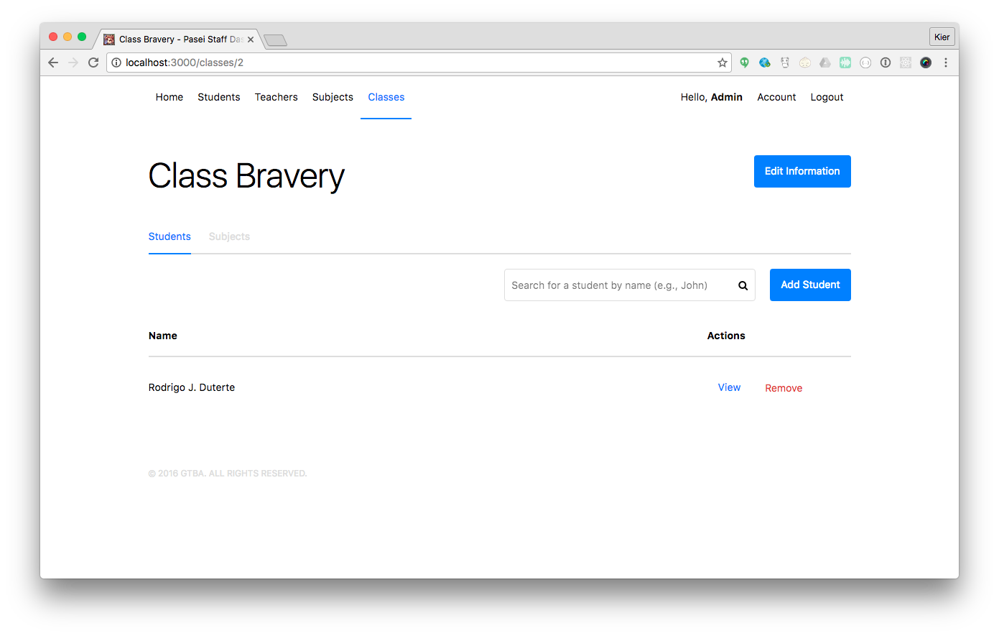

# pasei
Pasei is a school grading system for Pasay High School written [Laravel 5.3](https://laravel.com/docs/5.3).



## Requirements
- PHP `>=5.6` (`PHP 7` works) and [Composer](https://getcomposer.org/)
- Node.js `>=4.x` / npm `>= 2.x`
- MySQL `5.6`

## Setup
- **Install dependencies**
```bash
composer install
npm install
```

- **Setup environment file** &mdash; Afterwards, don't forget to check `.env` and fill up the database fields properly. Also, we have a mailing features so don't forget to setup the email config as well. **But**, you can leave it out by setting the value of `MAIL_DRIVER` to `log` (`MAIL_DRIVER=log`)
```bash
cp .env.example .env
```

- **Run database migrations**
```bash
artisan migrate
artisan db:seed # Optional. Leave out to set a clean database.
```

- **Generate key**
```bash
artisan key:generate
```

- **Setup assets**
```bash
gulp # Build the assets one time, or
gulp && gulp watch # If you're actively working
```
